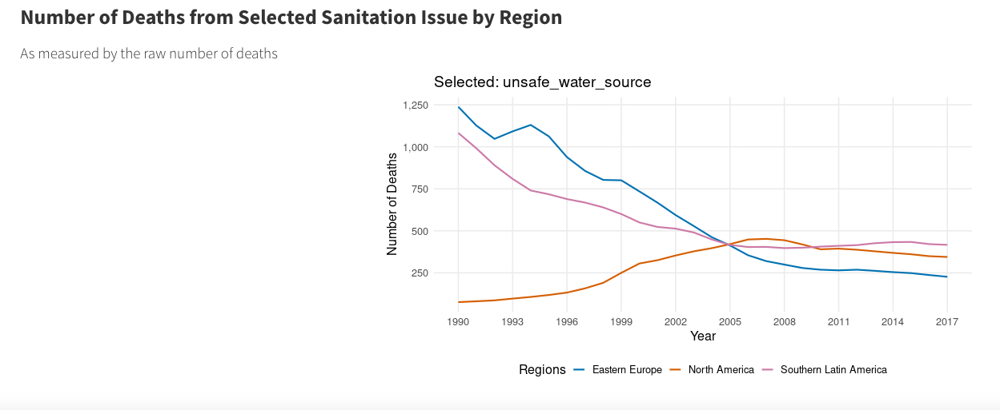

```{r load-packages, include = FALSE}
# Add any additional packages you need to this chunk
# Remove any packages from this list that you're not using
library(tidyverse)
library(knitr)
library(xaringanthemer)
library(here)
```

```{r setup, include = FALSE}
# For better figure resolution
knitr::opts_chunk$set(
  fig.retina = 3, 
  dpi = 300, 
  fig.width = 6, 
  fig.asp = 0.618, 
  out.width = "70%"
  )
```

```{r title-slide, echo = FALSE}
style_xaringan(title_slide_background_image = 
                 "presentation_files/title_image.jpg")
```

class: inverse

# Motivation 

.pull-left[

- Aim and motivation: Communicate the harmful effects of certain risk factors on 
the world through time via a Shiny app

- Potential Users:

  - Global researchers, policymakers, citizens

- 3 Categories of Risk Factors: 

1. air pollution

2. substance use

3. sanitation
  
]

```{r risk-factor, echo = FALSE, out.width = "50%", fig.align = "right"}
include_graphics("presentation_files/airpollution.jpg")
```

---

class: inverse, middle

## Approach

.pull-left[

- Data cleaning and merging
  
  - Utilizing Rds files
  
- 3 main data sets:

  - The Death by Risk Factor Data from Our World in Data via Kaggle 
  
  - The World Map Data from Maps Package
  
  - Population Data from Our World in Data
  
  - The World Map Data from Maps Package
  
- Map with a time and interactive functionality

  - Plotly

- Line plots 

]

```{r approach-image, echo = FALSE, out.width = "50%", fig.align = "right"}
include_graphics("presentation_files/coding.jpg")
```

---

### Map Example

```{r map-example, echo = FALSE, out.width = "60%", fig.align = "center"}

```

---

### Line Graph Example

```{r line-graph-example, echo = FALSE, out.width = "90%", fig.align = "center"}

```

---

class: inverse

# The Shiny App

<iframe height="360" width="640" src="https://warpwire.duke.edu/w/-VUGAA/" frameborder="0" scrolling="0" allow="autoplay *; encrypted-media *; fullscreen *; picture-in-picture *;" allowfullscreen></iframe>

---

## Trends - Air Pollution

Death rates attributable to air pollution in total have consistently fallen 
throughout the 25 years on the time slider. For instance, the US’ death rate due 
to air pollution (total) has dropped from 31.19 in 1990 to 19.95 in 2015. 


```{r risk-factor-air, echo = FALSE, out.width = "100%", fig.align = "center"}
  
```

---

## Trends - Alcohol Use

Canada and the US in 1990 started with polar opposite deaths of 0.37 and 1.08 respectively. However, both countries faced continuously rising death rates, and by 2015, death rates due to alcohol use in Canada and the US were 1.16 and 1.38. 

Regions with the highest death rates due to alcohol use: Eastern Europe (particularly Russia, Romania, and Ukraine, each with a death rate higher than two).  


```{r risk-factor-alc, echo = FALSE, out.width = "100%", fig.align = "center"}
  
```

---

## Limitations

- Speed of Shiny app

- Not all age standardized

- Variable names as labels

- Did not include all risk categories

- Original data includes negative death rates


---

class: inverse, middle, center

# Thank You! 
# Questions?


