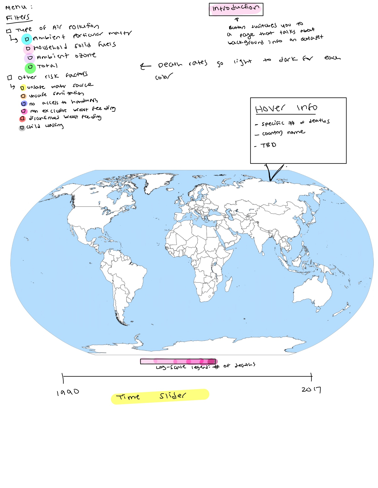

Project Proposal
================

## Load Data

``` r
# still need to upload deaths by risk factor (I am getting an error that says "Unexpected Response from Server, probably because the file is large)

# air pollution data
death_rates_total_air_pollution_csv <- read_csv(here("data", "death-rates-total-air-pollution.csv"))
```

    ## Rows: 6468 Columns: 4

    ## ── Column specification ────────────────────────────────────────────────────────
    ## Delimiter: ","
    ## chr (2): Entity, Code
    ## dbl (2): Year, Deaths - Air pollution - Sex: Both - Age: Age-standardized (R...

    ## 
    ## ℹ Use `spec()` to retrieve the full column specification for this data.
    ## ℹ Specify the column types or set `show_col_types = FALSE` to quiet this message.

``` r
death_rates_from_air_pollution_csv <- read_csv(here("data", "death-rates-from-air-pollution.csv"))
```

    ## Rows: 6468 Columns: 7

    ## ── Column specification ────────────────────────────────────────────────────────
    ## Delimiter: ","
    ## chr (2): Entity, Code
    ## dbl (5): Year, Deaths - Air pollution - Sex: Both - Age: Age-standardized (R...

    ## 
    ## ℹ Use `spec()` to retrieve the full column specification for this data.
    ## ℹ Specify the column types or set `show_col_types = FALSE` to quiet this message.

``` r
share_deaths_air_pollution_csv <- read_csv(here("data", "share-deaths-air-pollution.csv"))
```

    ## Rows: 6412 Columns: 4

    ## ── Column specification ────────────────────────────────────────────────────────
    ## Delimiter: ","
    ## chr (2): Entity, Code
    ## dbl (2): Year, Air pollution (total) (IHME, 2019)

    ## 
    ## ℹ Use `spec()` to retrieve the full column specification for this data.
    ## ℹ Specify the column types or set `show_col_types = FALSE` to quiet this message.

``` r
# added _csv ending to eliminate need for naming later versions "clean"

# world map data 
world_map <- map_data("world") %>% as_tibble()
```

``` r
death_rates_total_air_pollution <- death_rates_total_air_pollution_csv %>%
  clean_names() %>% 
  rename(death_rate_air_pollution = 
           deaths_air_pollution_sex_both_age_age_standardized_rate)

death_rates_from_air_pollution <- death_rates_from_air_pollution_csv %>%
  clean_names() %>% 
  rename(death_rate_air_pollution = 
           deaths_air_pollution_sex_both_age_age_standardized_rate, 
       death_rate_household_pollution = deaths_household_air_pollution_from_solid_fuels_sex_both_age_age_standardized_rate, 
       death_rate_ambient_matter_pollution = deaths_ambient_particulate_matter_pollution_sex_both_age_age_standardized_rate, 
       death_rate_ozone_pollution = 
         deaths_ambient_ozone_pollution_sex_both_age_age_standardized_rate)

#this looks messy but the column names are originally super long 

share_deaths_air_pollution <- share_deaths_air_pollution_csv %>% 
  clean_names() %>% 
  rename(share_death_air_pollution = air_pollution_total_ihme_2019)
```

``` r
glimpse(death_rates_total_air_pollution)
```

    ## Rows: 6,468
    ## Columns: 4
    ## $ entity                   <chr> "Afghanistan", "Afghanistan", "Afghanistan", …
    ## $ code                     <chr> "AFG", "AFG", "AFG", "AFG", "AFG", "AFG", "AF…
    ## $ year                     <dbl> 1990, 1991, 1992, 1993, 1994, 1995, 1996, 199…
    ## $ death_rate_air_pollution <dbl> 299.4773, 291.2780, 278.9631, 278.7908, 287.1…

``` r
glimpse(death_rates_from_air_pollution)
```

    ## Rows: 6,468
    ## Columns: 7
    ## $ entity                              <chr> "Afghanistan", "Afghanistan", "Afg…
    ## $ code                                <chr> "AFG", "AFG", "AFG", "AFG", "AFG",…
    ## $ year                                <dbl> 1990, 1991, 1992, 1993, 1994, 1995…
    ## $ death_rate_air_pollution            <dbl> 299.4773, 291.2780, 278.9631, 278.…
    ## $ death_rate_household_pollution      <dbl> 250.3629, 242.5751, 232.0439, 231.…
    ## $ death_rate_ambient_matter_pollution <dbl> 46.44659, 46.03384, 44.24377, 44.4…
    ## $ death_rate_ozone_pollution          <dbl> 5.616442, 5.603960, 5.611822, 5.65…

``` r
glimpse(share_deaths_air_pollution)
```

    ## Rows: 6,412
    ## Columns: 4
    ## $ entity                    <chr> "Afghanistan", "Afghanistan", "Afghanistan",…
    ## $ code                      <chr> "AFG", "AFG", "AFG", "AFG", "AFG", "AFG", "A…
    ## $ year                      <dbl> 1990, 1991, 1992, 1993, 1994, 1995, 1996, 19…
    ## $ share_death_air_pollution <dbl> 13.56, 13.19, 13.05, 12.88, 12.80, 12.98, 12…

``` r
glimpse(world_map)
```

    ## Rows: 99,338
    ## Columns: 6
    ## $ long      <dbl> -69.89912, -69.89571, -69.94219, -70.00415, -70.06612, -70.0…
    ## $ lat       <dbl> 12.45200, 12.42300, 12.43853, 12.50049, 12.54697, 12.59707, …
    ## $ group     <dbl> 1, 1, 1, 1, 1, 1, 1, 1, 1, 1, 2, 2, 2, 2, 2, 2, 2, 2, 2, 2, …
    ## $ order     <int> 1, 2, 3, 4, 5, 6, 7, 8, 9, 10, 12, 13, 14, 15, 16, 17, 18, 1…
    ## $ region    <chr> "Aruba", "Aruba", "Aruba", "Aruba", "Aruba", "Aruba", "Aruba…
    ## $ subregion <chr> NA, NA, NA, NA, NA, NA, NA, NA, NA, NA, NA, NA, NA, NA, NA, …

## One Sentence High-Level Goal

Create an interactive spatio-temporal visualization of worldwide deaths
related to air pollution.

## Description of our Goals and Motivation

A one to two paragraph description of your goals, including your
motivation. - Depending on the focus of your project, the following
might go in here. - If using a particular dataset(s), a brief
description of each dataset including the reason why you chose the
particular dataset, its dataset, its dimensions and any other relevant
metadata. (Make sure to load the data and use inline code for some of
this information.) - If answering a particular research question, the
question itself and the reason why you chose this question.

The goal of our Shiny App is to communicate the harmful effects of air
pollution on the world through time by visually displaying the deaths
caused by air pollution. Our interactive map will display death rates in
countries across the world from 1990 to 2017 caused by different types
of air pollution (e.g., household air pollution from solid fuels and
ambient particulate matter pollution). The app will also utilize the
hover feature to display more detailed information about the deaths,
including age and sex. The motivation to create such an app is to
effectively show the deadly effects of air pollution across the globe,
potentially showing the inequitable harm on countries that have less
resources to protect against air pollution. By consolidating the huge
amount of data available in a concise and informative way, the need to
address air pollution can be better understood by more people.

Our dataset involves four different csv files. The first csv file
includes death figures (by air pollution type) by country from 1990 to
2017 - 7 variables and 6468 observations. The 2nd csv file simply
includes the death figures by country from 1990 to 2017, regardless of
air pollution type - 4 variables and 6468 observations . The 3rd csv
file includes death figures (by risk factor - unsafe water, unsafe
sanitation, no access to hand wash, household air pollution,
Non-exclusive breast feeding, discontinued breast feeding and child
wasting etc.) by country from 1990 to 2017 - 32 variables and
\_\_\_\_\_\_ observations. The 4th csv file includes the proportion of
deaths attributed to air pollution in countries from 1990 to 2017 - 4
variables and 6412 observations. Visual draft of our map can be found in
the appendix.

## Weekly Plan of Attack

1.  Week 1 of project (week of Mon, Oct 18): Pick a focus for your
    project.

-   Brainstormed project ideas and pick data (All during Lab).
-   Ran project idea by Vittorio (All during Lab).

2.  Week 2 of project (week of Mon, Oct 25): Work on developing your
    project proposal and setting up the structure for your repository.

-   Set up repo structure (Courtney).
-   Start working on proposal (All assigned out own parts).

3.  Week 3 of project (week of Mon, Nov 1): Finalize your project
    proposal.

-   **Proposals for peer review: due Fri, Nov 5 at 5pm.**
-   Talk with Professor Cetinkaya-Rundel during office hours to receive
    semi-approval to begin working on the project. We hope to get
    started early in anticipation of challenges, and we do not want to
    be doing this project last minute. (Whoever is available during
    office hours time).
-   Ideally, start working on framework for project. Picking which
    variables to use for the visualization and brainstorming a “draft”
    visualization (All of us during weekly meeting).

4.  Week 4 of project (week of Mon, Nov 8): Conduct peer review on
    project proposals, and optionally, submit in an updated version of
    your proposal.

-   **Revised proposals for instructor review: due Fri, Nov 12 at 5pm**
-   Update proposal (All during weekly meeting)
-   Research information about creating interactive spatio-temporal
    visualizations on Shiny. (All)
-   Organize notes in the Google Doc. (All, while doing research)
-   Ideally, this step will help us from jumping in blind to the project
    and will provide us a solid foundation to begin our work on.

5.  Week 5 of project (week of Mon, Nov 15): Continue working on your
    project.

-   Start coding the spatio-temporal visualization of worldwide deaths
    related to air pollution.
-   At this point, we would like to decide if we will need to introduce
    any other data to our visualization.

6  Week 6 of project (week of Mon, Nov 22): Continue working on your
project. + Continue working on the visualization. + If necessary,
introduce outside/additional data.

7  Week 7 of project (week of Mon, Nov 29): Conduct another round of
peer review. + Ideally, we would like to have the coding part of our
project done by the end of this week. That would give us the following
week to reflect, make any final touches, and plan for the presentation.

8.  Write-up and presentation: due Fri, Dec 3 at noon (beginning of
    class).

-   Make any final touches.
-   Craft presentation. Prepare for in-class presentation on LDOC.

### Weekly Meeting Date and Time

We plan to have our scheduled meetings weekly on Wednesdays before
lecture. We will decide how early to start before class based on how
much work we anticipate needed to get through for the day.

## Repo Organization

The project is organized into 4 main folders:

-   `data`: includes our world air pollution datasets
-   `images`: includes any images, logos, and gifs for our Shiny App
-   `proposal`: includes our Project 2 proposal files
-   `shinyapp`: contains our files that build to the Shiny App. We will
    include more subfolders into this folder as we build the app as
    needed

## Appendix



## References

Below is a list of references we plan to use when creating our project.

-   <https://stackoverflow.com/questions/52087675/interactive-shiny-app-with-r-hovering-over-points-and-displaying-info>
-   <https://rviews.rstudio.com/2019/10/09/building-interactive-world-maps-in-shiny/>
-   <https://stackoverflow.com/questions/52087675/interactive-shiny-app-with-r-hovering-over-points-and-displaying-info>

## Data Reference

-   <https://www.kaggle.com/pavan9065/air-pollution>
