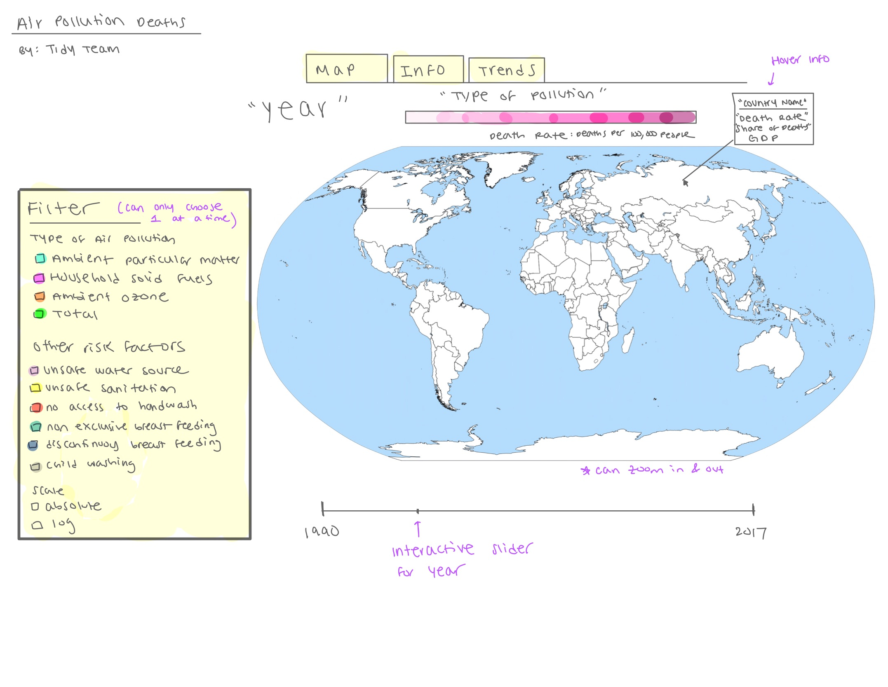

Project Proposal
================

## Load Data

``` r
# air pollution data
death_rates_total_air_pollution_csv <- read_csv(
  here("data", "death-rates-total-air-pollution.csv"), show_col_types = FALSE)

death_rates_from_air_pollution_csv <- read_csv(
  here("data", "death-rates-from-air-pollution.csv"), show_col_types = FALSE)

share_deaths_air_pollution_csv <- read_csv(
  here("data", "share-deaths-air-pollution.csv"), show_col_types = FALSE)

number_deaths_by_risk_factor_csv <- read_csv(
  here("data", "number-of-deaths-by-risk-factor.csv"), show_col_types = FALSE)

gdp_by_country_csv <- read_csv(
  here("data", "gdp-data.csv"), show_col_types = FALSE)

# added _csv ending to eliminate need for naming later versions "clean"

# world map data
world_map <- map_data("world") %>% as_tibble()
```

Glimpsed data can be found in the appendix.

## One Sentence High-Level Goal

Create an interactive spatio-temporal visualization of worldwide deaths
related to air pollution.

## Description of our Goals and Motivation

The goal of our Shiny App is to communicate the harmful effects of air
pollution on the world through time by visually displaying the deaths
caused by air pollution. Our interactive map will display the death rate
(deaths per 100,000) in countries across the world from 1990 to 2017
caused by different types of air pollution (e.g. household air pollution
from solid fuels and ambient particulate matter pollution). The
motivation to create such an app is to effectively show the deadly
effects of air pollution across the globe, potentially showing the
inequitable harm on countries that have less resources to protect
against air pollution. By consolidating the huge amount of data
available in a concise and informative way, the need to address air
pollution can be better understood by more people.

#### Shiny App User Interaction

The app will first display the map page, which is set as the first tab
of the page, labeled “Map”. The second tab will be labeled “Info”, which
will display a paragraph description of the summary of the data, where
we got the data from, and the goals of the app. The third tab, labeled
“Trends”, will display screenshots comparing different ranges of years
that our time found particularly interesting to highlight. The Trends
tab is meant to provide users an idea of the overarching observations of
our map. See the appendix for the sketch of our interface and choices
available for the user. Within the Map tab, the user will interact with
a side menu, giving them the ability to select the type of pollution the
map will display. Each type of pollution is associated with a different
continuous color scale. The colors on the map will go from light to dark
according to the death rate in the country (deaths per 100,000 people).
The user will also have the option to choose a type of risk factor
instead of type of air pollution in the side menu. When selected, the
map will instead show the number of deaths in the country by the risk
factor. The types of risk factors are included in the appendix. After
selecting the type of pollution/risk factor, the user selects whether or
not the user wants to see death rates in an absolute scale or a log
scale. After the map displays the colors according to the user’s
selection, the user can further interact with the map by sliding the
time slider located under the map to select a specific year to display,
ranging from 1990 to 2017. We are also exploring animating the slider.
On the map, the user can use their mouse to hover over each country,
displaying a small box over the country that shows the name, GDP per
capita, and death rate of the country.

#### Tools

We will be using the [leaflet
package](https://rstudio.github.io/leaflet/) to create our interactive
map. Although we could geom\_polygon for this process, we wanted to
explore a new package and look into something that we have not learned
in class yet. The leaflet package will enable us to make the map
interactive in the sense that not only will the user be able to zoom and
view country labels, but we can also add markers for locations of
importance and add various other layers to our map.

Our dataset involves five different imported csv files. The first csv
file includes the rate of death by air pollution type and by country
from 1990 to 2017 - 7 variables and 6468 observations. The second csv
file simply includes the rate of death by country from 1990 to 2017,
regardless of air pollution type - 4 variables and 6468 observations.
According to the data source, death rates are standardized to account
for the differences in distributions of ages of populations between
countries. so that countries can be directly compared. The third csv
file includes the number of deaths by risk factor (unsafe water, unsafe
sanitation, no access to hand wash, household air pollution,
Non-exclusive breast feeding, discontinued breast feeding and child
wasting etc.) and by country from 1990 to 2017 - 32 variables and 6468
observations. The fourth csv file includes the proportion of deaths
attributed to air pollution in countries from 1990 to 2017 - 7 variables
and 6412 observations. The fifth csv file includes the annual GDP per
capita for each country in current USD from 1990 to 2017 - 30 variables
and 266 observations. There is some missing data for some countries in
the 1960s and 1970s but the vast majority of observations are complete
so this dataset will suffice; however, limitation will be clearly noted
in the shiny model. Perhaps we will include a tab that details missing
data points so the user understands limitations.

Visual draft of our map can be found in the appendix.

## Weekly Plan of Attack

1.  Week 1 of project (week of Mon, Oct 18): Pick a focus for your
    project.

-   Brainstormed project ideas and pick data (All collaborated during
    Lab).
-   Ran project idea by Vittorio (All collaborated during Lab).

2.  Week 2 of project (week of Mon, Oct 25): Work on developing your
    project proposal and setting up the structure for your repository.

-   Set up repo structure (Courtney).
-   Start working on proposal (All assigned our own parts).

3.  Week 3 of project (week of Mon, Nov 1): Finalize your project
    proposal.

-   **Proposals for peer review: due Fri, Nov 5 at 5pm.**
-   Talk with Professor Cetinkaya-Rundel during office hours to receive
    semi-approval to begin working on the project. We hope to get
    started early in anticipation of challenges, and we do not want to
    be doing this project last minute. (Drew).
-   Ideally, start working on framework for project. Picking which
    variables to use for the visualization and brainstorming a “draft”
    visualization (All of us during weekly meeting).

4.  Week 4 of project (week of Mon, Nov 8): Conduct peer review on
    project proposals, and optionally, submit in an updated version of
    your proposal.

-   **Revised proposals for instructor review: due Fri, Nov 12 at 5pm**
-   Update proposal (All during weekly meeting)
-   Finish revising proposal. (We eat took responsibility for individual
    parts following our meeting.)
-   Research information and packages about creating interactive
    spatio-temporal visualizations on Shiny. (All)
-   Organize notes in the Google Doc. (All, while doing research)
-   Ideally, this step will help us from jumping in blind to the project
    and will provide us a solid foundation to begin our work on.

5.  Week 5 of project (week of Mon, Nov 15): Continue working on your
    project.

-   Data wrangling to fix any messiness in the code and join any needed
    datasets (Kathryn and Drew).
-   Start coding the spatio-temporal visualization of worldwide deaths
    related to air pollution. (Kathryn and Drew)
-   Create the framework (shell) for the shiny app (Courtney and
    Raghav).
-   At this point, we will decide if we will need to introduce any other
    data to our visualization.

6.  Week 6 of project (week of Mon, Nov 22): Continue working on your
    project.

-   Continue working on the visualization (Kathryn and Drew). Courtney
    and Rishal will provide feedback and suggest ideas for revisions.
-   Continue developing the shiny app (Courtney and Raghav). Kathryn and
    Drew will provide feedback and suggest ideas for revisions.
-   Thanksgiving break is this week, and we hope to be in a comfortable
    position to not have to work over break. However, if it appears
    necesarry we will spend time over break.
-   If necessary, introduce outside/additional data.

7  Week 7 of project (week of Mon, Nov 29): Conduct another round of
peer review. + Incorporate the visualization into the shiny app (All of
us with collaborate). + Ideally, we would like to have the coding part
of our project done by the beginning of this week. That would give us
the rest of the week to reflect, make any final touches, and plan for
the presentation. + Make any final touches. (All) + Create presentation
and prepare for in-class presentation (We will assign someone to take
lead on this later on.)

8.  Write-up and presentation: due *Fri, Dec 3 at noon* (beginning of
    class).

### Weekly Meeting Date and Time

We plan to have our scheduled meetings weekly on Wednesdays before
lecture. We will decide how early to start before class based on how
much work we anticipate needed to get through for the day.

## Repo Organization

The project is organized into 6 main folders:

-   `data`: includes our world air pollution datasets and the data
    dictionary.
-   `images`: includes any images, logos, and gifs for our Shiny App.
-   `proposal`: includes our Project 2 proposal files.
-   `pollution_map`: contains our files that build to the Shiny App.
    This includes data wrangling and visualization steps, as well as the
    final shiny app files. We will include more sub folders into this
    folder as we build the app as needed.
-   `presentation`: includes our presentation files.
-   `exploratory_work` : includes any initial exploratory data analysis,
    visualizations, or other attempts at our project. We intend to
    delete this folder before the project is complete, but are using it
    now as a workspace.

## Appendix

### Glimpse Data

``` r
glimpse(death_rates_total_air_pollution)
```

    ## Rows: 6,468
    ## Columns: 4
    ## $ entity                   <chr> "Afghanistan", "Afghanistan", "Afghanistan", …
    ## $ code                     <chr> "AFG", "AFG", "AFG", "AFG", "AFG", "AFG", "AF…
    ## $ year                     <dbl> 1990, 1991, 1992, 1993, 1994, 1995, 1996, 199…
    ## $ death_rate_air_pollution <dbl> 299.4773, 291.2780, 278.9631, 278.7908, 287.1…

``` r
glimpse(death_rates_from_air_pollution)
```

    ## Rows: 6,468
    ## Columns: 7
    ## $ entity                              <chr> "Afghanistan", "Afghanistan", "Afg…
    ## $ code                                <chr> "AFG", "AFG", "AFG", "AFG", "AFG",…
    ## $ year                                <dbl> 1990, 1991, 1992, 1993, 1994, 1995…
    ## $ death_rate_air_pollution            <dbl> 299.4773, 291.2780, 278.9631, 278.…
    ## $ death_rate_household_pollution      <dbl> 250.3629, 242.5751, 232.0439, 231.…
    ## $ death_rate_ambient_matter_pollution <dbl> 46.44659, 46.03384, 44.24377, 44.4…
    ## $ death_rate_ozone_pollution          <dbl> 5.616442, 5.603960, 5.611822, 5.65…

``` r
glimpse(share_deaths_air_pollution)
```

    ## Rows: 6,412
    ## Columns: 4
    ## $ entity                    <chr> "Afghanistan", "Afghanistan", "Afghanistan",…
    ## $ code                      <chr> "AFG", "AFG", "AFG", "AFG", "AFG", "AFG", "A…
    ## $ year                      <dbl> 1990, 1991, 1992, 1993, 1994, 1995, 1996, 19…
    ## $ share_death_air_pollution <dbl> 13.56, 13.19, 13.05, 12.88, 12.80, 12.98, 12…

``` r
glimpse(number_deaths_by_risk_factor)
```

    ## Rows: 6,468
    ## Columns: 32
    ## $ entity                                   <chr> "Afghanistan", "Afghanistan",…
    ## $ code                                     <chr> "AFG", "AFG", "AFG", "AFG", "…
    ## $ year                                     <dbl> 1990, 1991, 1992, 1993, 1994,…
    ## $ unsafe_water_source                      <dbl> 7554.050, 7359.677, 7650.438,…
    ## $ unsafe_sanitation                        <dbl> 5887.748, 5732.770, 5954.805,…
    ## $ no_access_to_handwashing_facility        <dbl> 5412.315, 5287.891, 5506.657,…
    ## $ household_air_pollution_from_solid_fuels <dbl> 22388.50, 22128.76, 22873.77,…
    ## $ non_exclusive_breastfeeding              <dbl> 3221.139, 3150.560, 3331.349,…
    ## $ discontinued_breastfeeding               <dbl> 156.09755, 151.53985, 156.609…
    ## $ child_wasting                            <dbl> 22778.85, 22292.69, 23102.20,…
    ## $ child_stunting                           <dbl> 10408.439, 10271.976, 10618.8…
    ## $ low_birth_weight_for_gestation           <dbl> 12168.56, 12360.64, 13459.59,…
    ## $ secondhand_smoke                         <dbl> 4234.808, 4219.597, 4371.908,…
    ## $ alcohol_use                              <dbl> 356.5293, 320.5985, 293.2570,…
    ## $ drug_use                                 <dbl> 208.3254, 217.7697, 247.8333,…
    ## $ diet_low_in_fruits                       <dbl> 8538.964, 8642.847, 8961.526,…
    ## $ diet_low_in_vegetables                   <dbl> 7678.718, 7789.773, 8083.235,…
    ## $ unsafe_sex                               <dbl> 387.1676, 394.4483, 422.4533,…
    ## $ low_physical_activity                    <dbl> 4221.303, 4252.630, 4347.331,…
    ## $ high_fasting_plasma_glucose              <dbl> 21610.07, 21824.94, 22418.70,…
    ## $ high_total_cholesterol                   <dbl> 9505.532, NA, NA, NA, NA, 146…
    ## $ high_body_mass_index                     <dbl> 7701.581, 7747.775, 7991.019,…
    ## $ high_systolic_blood_pressure             <dbl> 28183.98, 28435.40, 29173.61,…
    ## $ smoking                                  <dbl> 6393.667, 6429.253, 6561.055,…
    ## $ iron_deficiency                          <dbl> 726.4313, 739.2458, 873.4853,…
    ## $ vitamin_a_deficiency                     <dbl> 9344.132, 9330.182, 9769.845,…
    ## $ low_bone_mineral_density                 <dbl> 374.8441, 379.8542, 388.1304,…
    ## $ air_pollution                            <dbl> 26598.01, 26379.53, 27263.13,…
    ## $ outdoor_air_pollution                    <dbl> 4383.83, 4426.36, 4568.91, 50…
    ## $ diet_high_in_sodium                      <dbl> 2737.198, 2741.185, 2798.560,…
    ## $ diet_low_in_whole_grains                 <dbl> 11381.38, 11487.83, 11866.24,…
    ## $ diet_low_in_nuts_and_seeds               <dbl> 7299.867, 7386.764, 7640.629,…

``` r
glimpse(gdp_by_country)
```

    ## Rows: 266
    ## Columns: 30
    ## $ country_name <chr> "Aruba", "Africa Eastern and Southern", "Afghanistan", "A…
    ## $ country_code <chr> "ABW", "AFE", "AFG", "AFW", "AGO", "ALB", "AND", "ARB", "…
    ## $ x1990        <dbl> 12306.7177, 698.0484, NA, 594.8996, 948.3382, 617.2304, 1…
    ## $ x1991        <dbl> 13495.7943, 705.4986, NA, 558.5990, NA, 336.5870, 19534.2…
    ## $ x1992        <dbl> 14045.47457, 684.37560, NA, 547.82307, NA, 200.85222, 205…
    ## $ x1993        <dbl> 14938.6816, 666.9862, NA, 438.2623, NA, 367.2792, 16515.6…
    ## $ x1994        <dbl> 16239.9878, 661.3184, NA, 376.3549, 251.0783, 586.4163, 1…
    ## $ x1995        <dbl> 16439.3564, 724.0622, NA, 459.3649, 398.7910, 750.6044, 1…
    ## $ x1996        <dbl> 16583.8759, 703.5731, NA, 495.7790, 522.6796, 1009.9777, …
    ## $ x1997        <dbl> 17927.9594, 720.7381, NA, 486.5230, 514.3852, 717.3806, 1…
    ## $ x1998        <dbl> 19077.6874, 662.2028, NA, 484.0907, 423.6190, 813.7903, 1…
    ## $ x1999        <dbl> 19355.3335, 636.8078, NA, 500.4362, 387.7851, 1033.2417, …
    ## $ x2000        <dbl> 20617.7505, 673.9670, NA, 502.0317, 556.8386, 1126.6833, …
    ## $ x2001        <dbl> 20670.3670, 592.6374, NA, 516.9279, 527.3335, 1281.6594, …
    ## $ x2002        <dbl> 20436.8871, 590.7509, 179.4266, 605.0610, 872.4944, 1425.…
    ## $ x2003        <dbl> 20833.9764, 759.4347, 190.6838, 681.8824, 982.9610, 1846.…
    ## $ x2004        <dbl> 22568.3750, 919.0054, 211.3821, 826.8165, 1255.5645, 2373…
    ## $ x2005        <dbl> 23300.7384, 1040.4465, 242.0313, 988.8394, 1902.4222, 267…
    ## $ x2006        <dbl> 24046.2264, 1145.9511, 263.7336, 1224.0576, 2599.5659, 29…
    ## $ x2007        <dbl> 25834.1118, 1282.3229, 359.6932, 1400.0860, 3121.9961, 35…
    ## $ x2008        <dbl> 27083.6349, 1360.0848, 364.6607, 1666.8998, 4080.9410, 43…
    ## $ x2009        <dbl> 24631.1820, 1329.7270, 438.0761, 1444.2019, 3122.7816, 41…
    ## $ x2010        <dbl> 23513.5277, 1554.1834, 543.3030, 1655.1301, 3587.8836, 40…
    ## $ x2011        <dbl> 24985.0139, 1686.6958, 591.1628, 1827.5183, 4615.4682, 44…
    ## $ x2012        <dbl> 24712.4933, 1672.3637, 641.8714, 1936.3910, 5100.0970, 42…
    ## $ x2013        <dbl> 26441.6199, 1653.1884, 637.1655, 2123.3924, 5254.8811, 44…
    ## $ x2014        <dbl> 26893.0115, 1658.6501, 613.8565, 2166.7433, 5408.4117, 45…
    ## $ x2015        <dbl> 28396.9084, 1507.8003, 578.4664, 1886.2482, 4166.9798, 39…
    ## $ x2016        <dbl> 28452.1706, 1404.9532, 509.2201, 1666.4224, 3506.0731, 41…
    ## $ x2017        <dbl> 29350.8050, 1540.2325, 519.8889, 1606.9783, 4095.8101, 45…

``` r
glimpse(world_map)
```

    ## Rows: 99,338
    ## Columns: 6
    ## $ long      <dbl> -69.89912, -69.89571, -69.94219, -70.00415, -70.06612, -70.0…
    ## $ lat       <dbl> 12.45200, 12.42300, 12.43853, 12.50049, 12.54697, 12.59707, …
    ## $ group     <dbl> 1, 1, 1, 1, 1, 1, 1, 1, 1, 1, 2, 2, 2, 2, 2, 2, 2, 2, 2, 2, …
    ## $ order     <int> 1, 2, 3, 4, 5, 6, 7, 8, 9, 10, 12, 13, 14, 15, 16, 17, 18, 1…
    ## $ region    <chr> "Aruba", "Aruba", "Aruba", "Aruba", "Aruba", "Aruba", "Aruba…
    ## $ subregion <chr> NA, NA, NA, NA, NA, NA, NA, NA, NA, NA, NA, NA, NA, NA, NA, …

### Draft of Map



## References

Below is a list of references we plan to use when creating our project.

-   <https://stackoverflow.com/questions/52087675/interactive-shiny-app-with-r-hovering-over-points-and-displaying-info>
-   <https://rviews.rstudio.com/2019/10/09/building-interactive-world-maps-in-shiny/>
-   <https://stackoverflow.com/questions/52087675/interactive-shiny-app-with-r-hovering-over-points-and-displaying-info>

Finally, while we initially brainstormed the idea for a Shiny app on air
pollution ourselves, we found through additional research that there
were [similar concepts](https://ourworldindata.org/air-pollution)
already created by Hannah Ritchie and Max Roser with Our World in Data.
While both our shiny app and their visualizations will include
interactive world maps, we think that ours is unique in that we will
have check boxes depending on the data the user wants to see. From what
we have seen online so far, it seems as though different maps are
created for different data (there is no centralized map with check boxes
for the data that is to be viewed). Additionally, we are hoping to
include GDP information in our map, which we do not think is already
done as differences in incomes of countries appears to just be mentioned
in text, not the visualization.

## Data Reference

Although accessed via
[Kaggle](https://www.kaggle.com/pavan9065/air-pollution), the data’s
original source is [Our World in Data](https://ourworldindata.org/),
which is a public data collection initiative led by the nonprofit Global
Change Data Lab. The nonprofit shares knowledge (and data) about the
world’s most pressing issues so that anyone has the tools and
information they need to work toward combating a particular global
problem. Our World in Data notes that their data sources include the
[Institute for Health Metrics and Evaluation (Global Burden of
Disease)](http://www.healthdata.org/results/data-visualizations) and
[State of Global Air](https://www.stateofglobalair.org/data) The data
was posted to Kaggle about a month ago and includes data spanning the
years 1990 to 2017.

We found GDP per capita data for each country over the years of interest
via the [World
Bank](https://data.worldbank.org/indicator/NY.GDP.PCAP.CD?end=2017&start=1990).
It appears from the bank’s website that the data was collected via World
Bank and Organisation for Economic Co-operation and Development (OECD)
databases.
